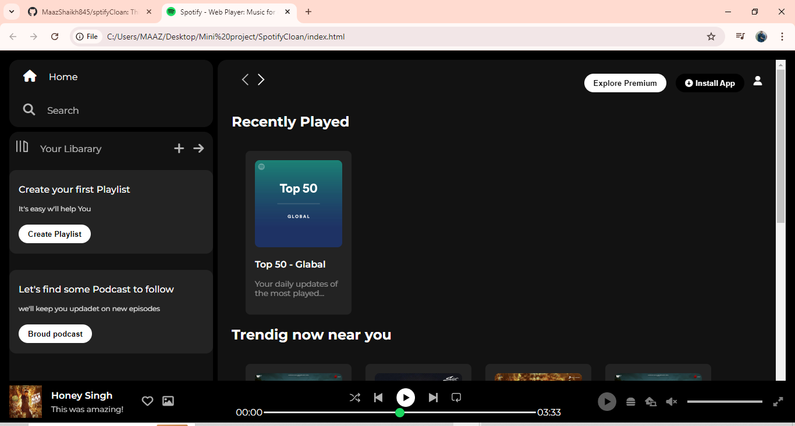
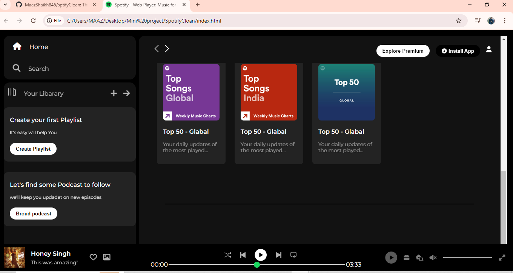

# Spotify Clone 🎵

This is a Spotify clone web application that allows users to browse, play music, create playlists, and experience features similar to the Spotify platform.

## Features ✨

- 🎶 **Browse Music**: Users can explore songs, albums, and artists.
- 🔍 **Search**: Search for songs, albums, and artists.
- ❤️ **Favorites**: Save favorite songs, albums, and artists for quick access.
- 🎧 **Play Music**: Stream music with play, pause, and skip controls.
- 📜 **Playlists**: Create and manage personal playlists.
- 🔄 **Responsive Design**: Works on all screen sizes.
- 🕶️ **Authentication**: Secure user login and signup features.

## Tech Stack 🛠️

- **Frontend**:
  - HTML5, CSS3.
  

## Screenshots 📸

